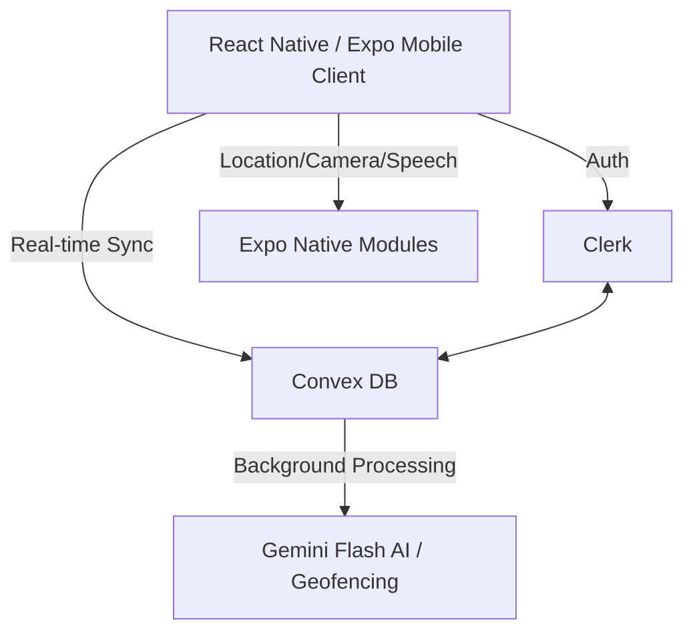

# FireVision.uk - Active Indoor Life Safety Navigation System

An active, real-time indoor life safety navigation system extending `firevision.uk`. Moves from passive regulatory compliance tracking to real-time evacuation navigation using a reactive architecture.

## User Review Required

> [!IMPORTANT]
> Please review the data schemas and proposed architecture to confirm they meet your exact structural vision before we begin code generation. 
> A `.env` file with placeholders has been created in the root directory. You can fill these in as we proceed.

## Map & API Decisions (Updated for v2)

Based on your feedback, we have resolved the initial open questions:

**1. Free Testing Alternatives & Mapping Heavy Lifting**
- Since this is primarily an *indoor* navigation app, we will use static floor plan images for the core evacuation navigation. No paid maps API is required for indoor routing.
- For exterior geofencing (knowing if the user is inside the building), we will use raw GPS coordinates from `expo-location` and perform mathematical distance calculations (Haversine formula) securely in the **Convex backend**. This is completely free and prevents exposing API keys in the client.
- If an exterior map view is needed during development, we will configure `react-native-maps` to use **OpenStreetMap (OSM)** tiles, which is a free alternative to Google Maps.

**2. Google Cloud Project & Keys**
- We will hold off on creating the full Google Cloud Project for now. 
- For the image ingestion engine, we can test using a free-tier Gemini API key from Google AI Studio. The actual Google Maps API will only be integrated when you are ready to transition to production.
- All required keys have been stubbed out in the local `.env` file.

## Proposed Architecture

**Frontend:** React Native with **Expo** (essential for swift compilation, cross-platform background location access, audio engines, and native Google Play deployment pipelines).
**Backend & Database:** **Convex** (ultra-low latency, WebSocket-based backend).
**Authentication:** **Clerk** (user identities, phone number verification, multi-tenant JWT session tokens integrated with Convex).
**Core Native Subsystems:** `expo-location` (GPS boundary tracking), `expo-camera` (image capture), and `expo-speech` (turn-by-turn audio directions).

## Process Details for Accounts (Clerk, Convex, Google)

> [!NOTE]
> Here is where and how your accounts will be linked. You can update the newly created `.env` file with these values when ready.

### Clerk Account
- **Usage:** Managing secure user identities, SMS OTP verification, and multi-tenant JWTs.
- **Action:** Create a new Application in Clerk.
- **Integration:** 
  - Retrieve the publishable key (`EXPO_PUBLIC_CLERK_PUBLISHABLE_KEY`).
  - Configure a JWT Template in Clerk named "convex" to allow secure Convex integration.

### Convex Account
- **Usage:** Real-time database, background automated actions, and file storage for floor plans/images.
- **Action:** Create a new project in the Convex dashboard.
- **Integration:** 
  - Retrieve the `CONVEX_DEPLOYMENT` and `EXPO_PUBLIC_CONVEX_URL` keys.
  - Link Convex with Clerk by adding the Clerk Issuer URL in Convex's `auth.config.js`.
  - Push the database schema to Convex.

### Google Account (Deferred for Production)
- **Usage:** Maps API (deferred) and Gemini Flash Vision AI.
- **Action:** 
  - We will use Google AI Studio for a free Gemini key (`GEMINI_API_KEY`) for now.
  - We will set up the Google Cloud Project and Google Play Console when nearing the publishing phase.

## Proposed Changes

---

### Phase 1: Database Schema & Authentication Configuration

We will create the Convex data model to track guests, admins, buildings, rooms, and incidents.

#### [NEW] [schema.ts](file:///c:/Users/uyko7/Documents/VSCode/evacuation_app/convex/schema.ts)
Schema setup with strict indexing:
- `users`: Track clerkId, phone, role (guest/admin).
- `locationConsent`: Compliance tracking for location sharing.
- `buildings`: Building details and coordinates.
- `rooms`: Floor plans and exit path data.
- `incidents`: Real-time incident triggers.

#### [NEW] [auth.config.ts](file:///c:/Users/uyko7/Documents/VSCode/evacuation_app/convex/auth.config.ts)
Configuration linking Clerk JWTs to Convex authentication.

---

### Phase 2: Core Step-by-Step Development Roadmap

#### 1. Project Initialization
- Run Expo initialization (`npx create-expo-app@latest -t expo-template-blank-typescript`) in `c:/Users/uyko7/Documents/VSCode/evacuation_app`.
- Install Tailwind/NativeWind.
- Install `convex`, `convex-react-client`, `@clerk/clerk-expo`.
- Set up `/components` and `/hooks`.

#### 2. Clerk Authentication & Consent Flow
- SMS OTP Verification screen.
- Mandatory, un-skippable **Location Consent Screen**.
- Convex mutation to write to `users` and `locationConsent`.

#### 3. Dual-Role Portal Architecture
- **Guest UI:** Minimalist home screen, "SCAN ROOM EVACUATION PLAN" button, manual trigger.
- **Admin Dashboard:** Building occupancy view, floor plan upload, and "TRIGGER BUILDING EVACUATION" mechanism.

#### 4. Image Ingestion Engine
- Use `expo-camera` to capture evacuation sign.
- Upload to Convex storage.
- Convex Action passes asset to **Gemini Flash Vision AI** (using free-tier key).
- Return JSON block mapping room ID to layout.

#### 5. Reactive Evacuation Navigation Engine
- Convex query listening to `incidents` table.
- Trigger high-intensity audio/visual alarms.
- Display `exitPathData` dynamically over the floor plan.
- Use `expo-speech` for audio turn-by-turn guidance synchronized with visual updates.

## Verification Plan

### Local Testing Plan
- **Setup Expo Go / Prebuild:** Run the application locally on an iOS/Android device via the Expo Go app or development build (`npx expo start`).
- **Convex Dev DB:** Use the Convex local development database (`npx convex dev`) to manually trigger an incident and verify the real-time sync latency (<100ms).
- **Clerk Testing:** Use Clerk's development mode and test phone numbers to verify OTP flows without incurring SMS costs.
- **Simulated Navigation:** Mock location coordinates in the local simulator to test `expo-speech` instructions and path overlay rendering on the frontend. OpenStreetMap can be used if a visual map is required.
- **Vision AI Mocking:** Test the `expo-camera` functionality and verify Convex Actions are successfully calling the Google Vision API (Gemini Flash) with sample sign images.

### Automated Tests
- Convex unit tests for schema validation and database mutations.
- Backend geofence calculation testing.

### Manual Verification
- Using a physical test device to walk a mapped path and verify step-counter / proximity updates trigger the next audio cue appropriately.
